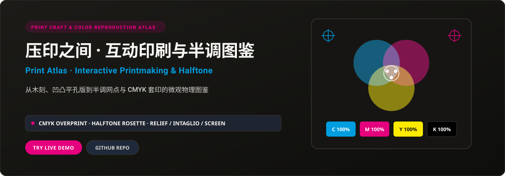

<p align="right">
  <strong>简体中文</strong> · <a href="./README.en.md">English</a>
</p>

<p align="center">
  
</p>

<p align="center">
  <a href="https://print-atlas.xiaosang.cc/"><strong>🌐 在线体验 (Live Demo)</strong></a> · 
  <a href="https://holynova.github.io/print-atlas/"><strong>🚀 备选镜像 (GitHub Pages)</strong></a> · 
  <a href="https://github.com/holynova/print-atlas"><strong>📦 GitHub 源码</strong></a> · 
  <a href="https://xiaosang.cc/"><strong>✨ 更多作品集</strong></a>
</p>

---

## 真实预览 (Proof of Work)

<p align="center">
  
</p>

---

## 项目简介 (What It Is)

探索图像如何从媒介转移到纸面的互动印刷物理图鉴。解构凸版木刻刀痕、凹版铜版画、平版石印与孔版丝网四大传统版画原理，并延伸至现代报刊与工业印刷的半调网点 (Halftone) 角度分布与 CMYK 四色叠印形成的微观玫瑰花结 (Rosette Pattern)。

---

## 核心机制与特色 (Why It Matters)

- **四大版画物理原理图解**：动态剖析凸印（浮雕）、凹印（刻线吸墨）、平印（水墨相斥）、孔印（网孔漏墨）转移逻辑。
- **CMYK 四色通道分色剥离**：支持自由开关青 (C)、品红 (M)、黄 (Y)、黑 (K) 单一通道，观察四色套叠成彩过程。
- **半调网点与玫瑰花结微观放大**：内置虚拟放大镜，观察 15°、45°、75° 网角交错产生的防摩尔纹精细几何网点。
- **纸张触感与油墨微观模拟**：呈现新闻纸纤维、铜版纸吸墨率与套印错位的真实物理印刷质感。

---

## 收录清单与规格 (Inventory & Scope)

传统四大版种互动图解、CMYK 分色套印模拟器、半调网点角度微观实验室、报刊印刷演进历史。

---

## 快速开始 (Quick Start)

### 1. 在线体验
无需安装任何环境，直接在浏览器中打开：
- 🌐 **主站演示 (Primary)**：[https://print-atlas.xiaosang.cc/](https://print-atlas.xiaosang.cc/)
- 🚀 **备选镜像 (GitHub Pages)**：[https://holynova.github.io/print-atlas/](https://holynova.github.io/print-atlas/)

### 2. 本地运行与调试
克隆仓库后执行以下命令：

```bash
git clone https://github.com/holynova/print-atlas.git
cd print-atlas
open index.html # Pure static HTML5, open directly in browser
```

---

## 开源协议与作者 (License & Author)

- **作者**：[holynova (小桑)](https://xiaosang.cc/)
- **授权协议**：[MIT License](./LICENSE)
- **合辑收录**：本仓库作为精选项目收录于 [Where Craft Lives (xiaosang.cc)](https://xiaosang.cc/)。
